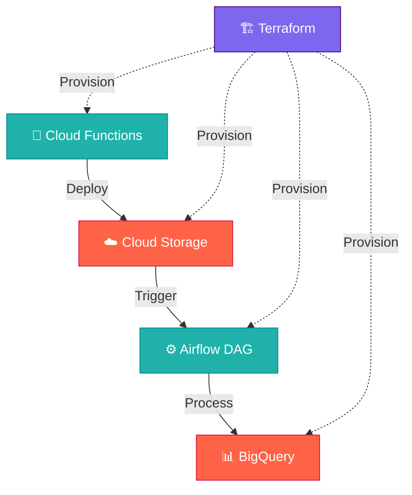

# 📊 Pipeline de Données Retail
Un pipeline complet pour générer, traiter et analyser des données retail synthétiques sur **Google Cloud Platform (GCP)**.
---
## 📌 Aperçu
Ce projet automatise le flux de données retail de la génération à l'analyse en utilisant les services GCP :
- **Génération de données** → **Stockage** → **Orchestration ETL** → **Analytics** → **Infrastructure as Code (IaC)**
---
## 🏗 Architecture


---
| Composant               | Technologie utilisée     | Rôle                                   |
|-------------------------|--------------------------|----------------------------------------|
| **Génération de données** | Cloud Functions (Python) | Génère des données clients/commandes   |
| **Stockage brut**       | Cloud Storage (GCS)      | Stocke les fichiers CSV/JSON bruts     |
| **Orchestration**       | Airflow (Cloud Composer) | Planifie et gère les workflows ETL     |
| **Data Warehouse**      | BigQuery                 | Tables partitionnées pour l'analyse    |
| **Infrastructure**      | Terraform                | Provisionnement automatisé des ressources GCP |

---

<!-- TREE_START -->
## 📁 Structure du projet

```
.
|-- 🎯 airflow
|   `-- dags
|       `-- retail_data_dag.py
|-- ☁️ cloud_functions
|   |-- consolidate_masters
|   |   |-- deploy.sh
|   |   |-- .gcloudignore
|   |   |-- main.py
|   |   `-- requirements.txt
|   |-- generate_customers_daily
|   |   |-- deploy.sh
|   |   |-- .gcloudignore
|   |   |-- main.py
|   |   `-- requirements.txt
|   |-- generate_products_daily
|   |   |-- deploy.sh
|   |   |-- .gcloudignore
|   |   |-- main.py
|   |   `-- requirements.txt
|   |-- generate_suppliers_daily
|   |   |-- deploy.sh
|   |   |-- .gcloudignore
|   |   |-- main.py
|   |   `-- requirements.txt
|   `-- shared
|       |-- config.py
|       |-- requirements.txt
|       `-- utils.py
|-- 🚀 .github
|   `-- workflows
|       |-- deploy.yml
|       `-- python-tests.yml
|-- 🛠️ scripts
|   |-- changelog.sh
|   `-- version.sh
|-- 🏗️ terraform
|   |-- main.tf
|   |-- outputs.tf
|   `-- variables.tf
|-- 🧪 tests
|   |-- conftest.py
|   |-- test_data_generator.py
|   |-- test_generate_products_daily.py
|   `-- test_generate_suppliers_daily.py
|-- .gitignore
|-- Makefile
|-- README.md
|-- requirements.txt
`-- update-readme.sh
```

*Arborescence générée automatiquement le 2025-06-12 à 12:12:33*
<!-- TREE_END -->
